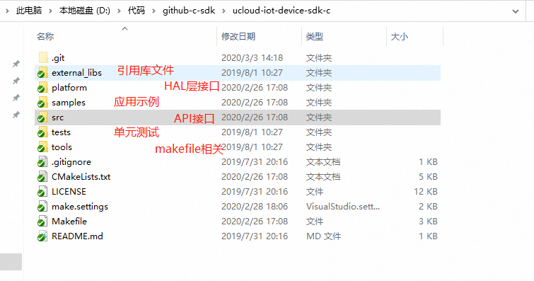

## 应用场景说明

C-SDK适用于使用C语言开发业务处理逻辑的设备, 由于C语言运行速度快/需要的运行内存较少, 目前大多数的IoT设备使用C语言进行功能开发，
当前设备需要支持TCP/IP协议栈或通过AT指令控制有联网能力的通信模组才能使用C-SDK。

## C-SDK结构说明

C-SDK将与操作系统和硬件平台相关的接口统一提取出来放在了hal层，用户移植的时候，只需要适配修改HAL层的接口，即C-SDK文件夹中的platform文件夹下的文件。

## C-SDK编译方式
* 使用C-SDK自带的编译系统，在Linux操作系统下使用。
* 将需要使用到的C-SDK文件抽取到用户使用的编译系统中，如IAR，Keil等，用户需要根据硬件平台或操作系统适配HAL层的接口。

## 移植流程

## 移植各场景指导文档
运行环境                                     | 移植指导
-------------------------------------------- | ----------------------------------------------------------------------------------------------------------------
Linux操作系统                                | [Linux下集成C-SDK](/linux_porting_guide.md)
MCU+支持TCP模组上集成C-SDK                   | [无RTOS STM32+AT控制通讯模组移植C-SDK](/nos_at_porting_guide.md)
运行Freertos的MCU上集成C-SDK                 | [运行Freertos的STM32+TCP/IP协议栈移植C-SDK](/freertos_lwip_porting_guide.md) 
运行RT-Thread的MCU+支持TCP模组               | [运行RT-Thread的STM+AT控制通讯模组上移植C-SDK](/rtthread_at_porting_guide.md)
支持TCP的通信模组上集成C-SDK                 | [运行Freertos的ESP32移植C-SDK](/esp32_freeros_porting_guide.md)

