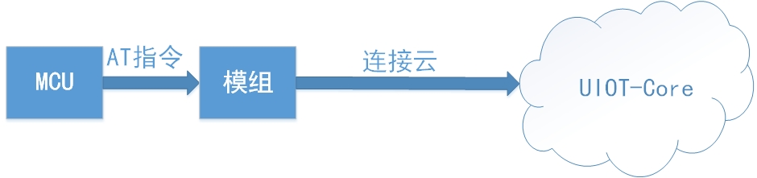

## 简介
RT-Thread是一个嵌入式实时多线程操作系统，系统完全开源，它不仅仅是一个实时内核，还具备丰富的中间层组件，包括如文件系统、图形库等较为完整的中间件组件，具备低功耗、安全、通信协议支持和云端连接能力的软件平台。
本文主要介绍如何将C-SDK移植到运行RT-Thread操作系统的STM32上，并通过STM32的串口发送AT指令控制移远EC20模组连接云平台，本文仅介绍演示移植MQTT传输功能。



## 准备工作

* 准备RT-Thread开发环境。

* 准备STM32开发板，本文使用的是STM32F767开发板。

### 准备RT-Thread开发环境
准备RT-Thread开发环境请参考：[RT_Thread官方指导文档](https://www.rt-thread.org/document/site/)

### 软件包目录结构
| 名称              | 说明 |
| ----              | ---- |
| uiot              | UCloud设备端C-SDK |
| ports             | 移植文件目录 |
| samples           | 示例目录 |
|  ├─mqtt           | 静态注册收发消息示例 |
|  ├─dynamic_auth   | 动态注册示例 |
|  ├─http           | Http连接云平台示例 |
|  ├─dev_model      | 物模型示例 |
|  ├─ota            | ota升级示例 |
|  ├─shadow         | 设备影子示例 |
| docs              | 说明文档 |
| LICENSE           | 许可证文件 |
| README.md         | 软件包使用说明 |
| SConscript        | RT-Thread 默认的构建脚本 |

### 使用UCloud IoT软件包
可以通过RT-Thread Env配置工具配置使用UCloud IoT软件包。<br>
menuconfig配置勾选软件包
- RT-Thread env开发工具中使用 `menuconfig` 软件包，配置产品及设备信息，
路径如下：
```
RT-Thread online packages  --->
    IoT - internet of things  --->
        IoT Cloud  --->
            [ ] ucloud_iot_sdk: Ucloud iot sdk for uiot-core platform.  --->
              --- ucloud_iot_sdk:  Ucloud iot sdk for uiot-core platform 
                Ucloud Device Config  --->                  
                [ ]   Enable Mqtt Link uiot-core Platform
                [ ]   Enable Http Link uiot-core Platform
                [ ]   Enable Ucloud Debug
                Version (latest)  --->	
```

### 软件包说明
根据产品需求选择合适的应用示例修改新增业务逻辑，也可新增例程编写新的业务逻辑。
```	
    --- ucloud_iot_sdk: Ucloud iot sdk for uiot-core platform.
          Ucloud Device Config  --->    
    [*]   Enable Mqtt Link uiot-core Platform
    [ ]     Enable Ucloud Mqtt Sample 
    [ ]     Enable Ucloud Mqtt Dynamic Auth Sample
    [*]   Enable Http Link uiot-core Platform
    [ ]     Enable Ucloud Http Publish Sample
    [ ]     Enable Ucloud Http Upload File Sample
    [*]   Enable Shadow      
    [ ]     Enable Ucloud Shadow Sample
    [*]   Enable Dev Model  
    [ ]     Enable Ucloud Dev Model Sample
    [*]   Enable Ota                                                                                                
    [ ]     Enable Ucloud Ota Sample  
    -*-   Enable Tls 
    [ ]   Enable Ucloud Debug
          Version (latest)  --->
```

- 选项说明

`Ucloud Device Config `：填写当前设备认证要素，当认证模式为动态认证时，设备密钥可以不填写

`Enable Mqtt Link uiot-core Platform`：使能MQTT连接云平台功能。

`Enable Ucloud Mqtt Sample`：使能静态注册mqtt和注册成功后收发消息的案例

`Enable Ucloud Mqtt Dynamic Auth Sample`: 使能动态注册mqtt和注册成功后收发消息的案例

`Enable Http Link uiot-core Platform`：使能HTTP连接云平台功能,包括使用https上传消息和上传文件，只支持https,勾选会关联选中mbedTLS软件包。

`Enable Ucloud Http Publish Sample`：使能使用https向云平台上传消息的案例

`Enable Ucloud Http Upload File Sample`: 使能使用https向云平台上传一段buffer在云端保存成文件的案例

`Enable Shadow`：使能设备影子功能

`Enable Ucloud Shadow Sample`：使能设备影子的案例

`Enable Dev Model`：使能物模型功能

`Enable Ucloud Dev Model Sample`：使能物模型的案例

`Enable Ota`：使能远程升级版本的功能，若使能由于要使用flash的分区功能进行ota升级，会关联选中fal软件包。

`Enable Ucloud Ota Sample`：使能远程升级版本的案例

`Enable TLS`： 是否使能TLS，若使能，则会关联选中mbedTLS软件包。

`Enable Ucloud Debug`: 使能调试打印输出

`Version (latest)  --->`：选择软件包的版本

- 使用 `pkgs --update` 命令下载需要使用的软件包

### 软件包依赖
Ota功能需要fal软件包

[ ] fal: Flash Abstraction Layer implement. Manage flash device and partition.  --->

Tls功能需要mbedtls软件包

[ ] mbedtls: An portable and flexible SSL/TLS library  ----

### 配置MQTT连接云平台功能
```            
    --- ucloud_iot_sdk: Ucloud iot sdk for uiot-core platform.
          Ucloud Device Config  --->    	
    [*]   Enable Mqtt Link uiot-core Platform
    [*]     Enable Ucloud Mqtt Sample 
    [ ]     Enable Ucloud Mqtt Dynamic Auth Sample
    [ ]   Enable Http Link uiot-core Platform
    [ ]   Enable Shadow      
    [ ]   Enable Dev Model  
    [ ]   Enable Ota                                                                                                
    [ ]   Enable Tls 
    [ ]   Enable Ucloud Debug
          Version (latest)  --->
```

### 配置认证要素 
```
    Ucloud Device Config    --->
    [*] Device Config  ---- 
    (5xaptnq5is1xt45c) Config Product SN
    (dy0jndfndj6wvvq0) Config Product Secret
    (tycfyk7697ra5jqs) Config Device SN                                                                           
    (6kh48wf6oq5xktir) Config Device Secret
```
### 保存配置，生成新工程编译烧写到开发板
xxx可以是mdk5或iar
```
scons --target=xxx
```

### 执行MQTT示例
```
msh />mqtt_test_example start                                                                                                       
establish tcp connection with server(host='mqtt-cn-sh2.iot.ucloud.cn', port=[1883])                                                 
msh />success to establish tcp, fd=4                                                                                                
Cloud Device Construct Successsubscribe success, packet-id=2                                                                        
publish success, packet-id=3                                                                                                        
Receive Message With topicName:/fahnimwwvph259ag/3um7h4fdiigf2yyh/upload/event, payload:{"test": "0"}                               
publish success, packet-id=4                                                                                                        
Receive Message With topicName:/fahnimwwvph259ag/3um7h4fdiigf2yyh/upload/event, payload:{"test": "1"}                               
publish success, packet-id=5                                                                                                        
Receive Message With topicName:/fahnimwwvph259ag/3um7h4fdiigf2yyh/upload/event, payload:{"test": "2"}                               
publish success, packet-id=6                                                                                                        
Receive Message With topicName:/fahnimwwvph259ag/3um7h4fdiigf2yyh/upload/event, payload:{"test": "3"}                               
publish success, packet-id=7                                                                                                        
Receive Message With topicName:/fahnimwwvph259ag/3um7h4fdiigf2yyh/upload/event, payload:{"test": "4"}                               
publish success, packet-id=8                                                                                                        
Receive Message With topicName:/fahnimwwvph259ag/3um7h4fdiigf2yyh/upload/event, payload:{"test": "5"}                               
publish success, packet-id=9                                                                                                        
Receive Message With topicName:/fahnimwwvph259ag/3um7h4fdiigf2yyh/upload/event, payload:{"test": "6"}                               
publish success, packet-id=10                                                                                                       
Receive Message With topicName:/fahnimwwvph259ag/3um7h4fdiigf2yyh/upload/event, payload:{"test": "7"}                               
publish success, packet-id=11                                                                                                       
Receive Message With topicName:/fahnimwwvph259ag/3um7h4fdiigf2yyh/upload/event, payload:{"test": "8"}                               
publish success, packet-id=12                                                                                                       
Receive Message With topicName:/fahnimwwvph259ag/3um7h4fdiigf2yyh/upload/event, payload:{"test": "9"} 
```


